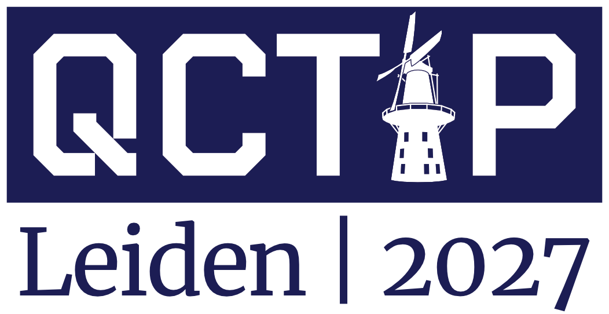

{:.center-image width=100%}
<!--
TODO: change figures
-->

## Quantum Computing Theory in Practice (QCTiP)

We are witnessing impressive progress in quantum hardware development and ongoing theoretical advancements
are bringing practical applications of this hardware closer to reality.
Quantum Computing Theory in Practice (QCTiP) aims to bring together the academic community and industry representatives to foster discussions on how to unlock the full potential of quantum computers.

- **Venue:** Staatsgehoorzaal, Leiden (the Netherlands) 
- **Dates:** 12-14 April 2027
- **Focus:** applied aspects of quantum computing theory
- ~400 participants
- brings together researchers, practitioners, and industry leaders
- keynote talks
- industry talks
- ~50 contributed talks
- ~200 poster presentations

{:.center-image width=100%}
<!--
TODO: change figures
-->

## Key Dates

- **Registration Opening:** TODO
- **Talk Submission Opening:** TODO
- **Talk Submission Deadline:** TODO
- **Poster Submission Deadline:** TODO
- **Talk Notification of Acceptance:** TODO
- **Poster Notification of Acceptance:** TODO
- **Registration Closing:** TODO
- **Conference Dates:** 12-14 April 2027

**[Sign Up](TODO-GoogleForm) to our mailing list to receive notifications of important events,
such as when registration opens.**
<!--
TODO: prepare a mailing list
-->

{:.center-image width=100%}
<!--
TODO: change figures
-->

## Local Organisers

- **Julius Mildenberger** (LION & aQa, Leiden University)
- **Stefano Polla** (HIMS, IvI & QuSoft, University of Amsterdam)
- **Anastasiia Skuraviska** (LIACS & aQa, Leiden University)
- **Jordi Tura** (LION & aQa, Leiden University)
- **Vedran Dunjko** (LIACS & aQa, Leiden University)

## Programme Committee Chair

- **TBD**
<!--
TODO: fill in once chosen
-->

## Steering Committee

- **B&aacute;lint Koczor** (Mathematical Institute, University of Oxford)
- **Ophelia Crawford** (Riverlane)
- **Elham Kashefi** (CNRS & Uni Edinburgh)
- **Jens Eisert** (FU Berlin)
- **Noah Linden** (Uni Bristol)
- **Ashley Montanaro** (Uni Bristol & Phasecraft)
<!--
TODO: verify this is still current
-->

## Code of Conduct

QCTiP2026 is committed to ensuring a harassment-free environment for all attendees, regardless of gender, gender identity and expression, sexual orientation, disability, physical appearance, body size, race, age, religion, or nationality. We maintain a zero-tolerance policy towards harassment in any form. Any participant found violating this code of conduct may face sanctions or expulsion from the conference, at the discretion of the organisers.

<!--
TODO: provide details for reporting CoC violations and getting local support. (see QCTiP 2025 website for example)
-->

## Confirmed Sponsors

{:.center-image width=100%}
<!--
TODO: change sponsor figure
-->