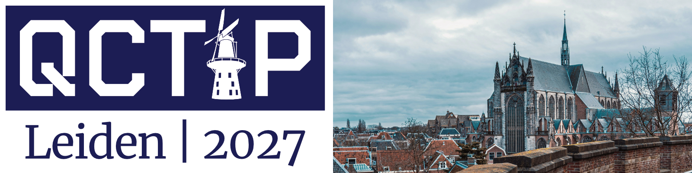
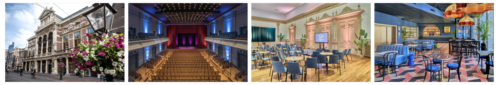
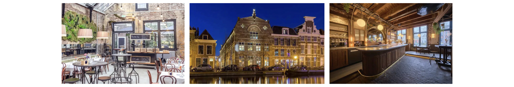

{:.center-image}

# Venue

### Conference Venue

QCTiP 2027 will be held in <strong>Leiden, the Netherlands</strong>, 
  a historic university city renowned for its vibrant academic community, 
  rich cultural heritage, and strong international research environment. 
  Leiden is home to Leiden University, founded in 1575, the oldest 
  university in the Netherlands. 

The conference will be held at the <strong>Stadsgehoorzaal Leiden</strong>, 
  the city's concert hall dating from 1891. It is a prominent venue 
  located in the heart of Leiden. 
  The venue provides a welcoming and professional setting 
  for bringing together researchers, academics, industry representatives, 
  and students from across the quantum computing community.

{:.center-images}

### Banquet Dinner

Banquet dinner will take place in a historic venue in the city center of Leiden. 

<!--{: style="width:100%;" .center-image}-->

# Travel Information

### About Leiden

Leiden is a historic university city with over 400 years of academic history, home to Leiden University — the oldest university in the Netherlands — world-class museums, picturesque canals, and a vibrant cultural scene.
The city is very well connected by rail with major Dutch and international destinations and is easily accessible from Amsterdam Airport Schiphol. Most Leiden University buildings and faculties are within walking or cycling distance of the city centre.

**Things to Do in leiden**

- Visit Burcht van Leiden
- Follow the Rembrandt trail
- Visit Hortus Botanicus (Botanical Garden)
- Visit Oude Sterrewacht (Old Observatory Leiden)
- Visit Rijksmuseum Boerhaave Museum

<!--
### Where to Eat in Leiden

**Restaurant Suggestions in the City Centre**
- 't Pannenkoekenhuysje Oudt Leyden – Dutch pancakes 
- Resto 2 – Brasserie dining on the High Street
- Resto 3 – Indian small plates & lively atmosphere
- Resto 4 – Contemporary European dining
- Resto 5 – Larger Thai option with a fun atmosphere for groups.-->

### Getting to Leiden

**By Air:**
- Schiphol Airport (approximately 30 min by train)

**By Train:**
- Direct trains from Amsterdam central and other major Dutch cities
- Use [NS app](https://www.ns.nl/en/travel/ns-app) for up-to-date travel information

**By Car:**
- Parking is very limited in the city centre

<!--
### Central Leiden Highlights 
**Start:**
The following central attractions are within 10–15 minutes’ walk of each other.
-->

### Finding Accommodation in Leiden

Please refer to [Registration](/registration) for information about recommended hotels and accommodation options.

